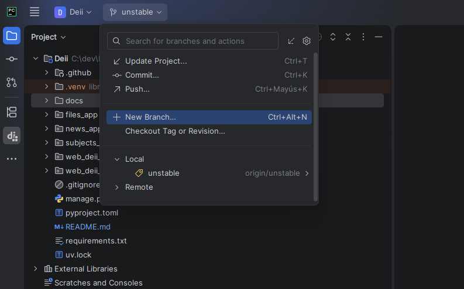
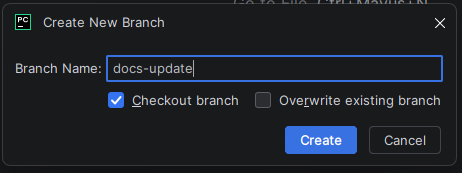

# Guía de Flujo de Trabajo en Git

Para mantener un historial de cambios limpio, organizado y fácil de leer, seguimos una serie de convenciones tanto para la creación de ramas como para la estructura de los commits.

---

## Nomenclatura de Ramas

Cuando se va a trabajar en una nueva funcionalidad, corrección de errores o tarea, se debe crear una rama independiente a partir de la rama de desarrollo activa (normalmente `unstable`).

### Estructura de Nombre de Rama

El nombre de la rama debe estar asociado a una **Historia de Usuario (User Story)** o **Ticket**, utilizando la siguiente convención:

```text
<identificador-ticket>-<nombre-modulo-o-descripcion>
```

- **identificador-ticket**: El ID de la historia de usuario o ticket (ej. `US-12`, `T-104`).
- **nombre-modulo-o-descripcion**: El nombre del módulo que se va a modificar o una breve descripción del cambio, en minúsculas y separando las palabras con guiones (`-`).

#### Ejemplos:
- `(insertar ejemplos)`


### Cómo crear una rama en el IDE (PyCharm)

1. En el menú superior o en la barra de estado de Git del IDE, abre el selector de ramas y selecciona **New Branch...**:
   
   

2. Introduce el nombre de la rama siguiendo el formato acordado y haz clic en **Create**:
   
   

---

## Nomenclatura para Commits

Para los commits del proyecto, utilizamos una convención simplificada basada en *Conventional Commits*.

## Estructura de un Commit

El formato básico debe ser el siguiente:

```text
<tipo> (<ámbito>): <descripción breve>
```

- **tipo**: La categoría del cambio que estás realizando (ver abajo).
- **ámbito** *(opcional)*: La sección del proyecto o módulo afectado (ej. `files`, `database`, `api`, `news`).
- **descripción**: Un resumen corto del cambio. Preferiblemente en minúsculas, usando verbos en imperativo/infinitivo (ej. "create", "add", "fix") y sin punto al final.

---

## Tipos de Commits

Estos son los prefijos que debes utilizar según el cambio realizado:

- **`feat`** (Feature): Añade una nueva funcionalidad o característica al proyecto.
  - *Ejemplo:* `feat (users): create a account`
  - *Ejemplo:* `feat (news): add image upload for articles`

- **`fix`** (Bug Fix): Soluciona un error o un bug en el código.
  - *Ejemplo:* `fix (auth): resolve login error with empty passwords`

- **`docs`** (Documentation): Cambios que solo afectan a la documentación (archivos README, guías de configuración, etc.).
  - *Ejemplo:* `docs (setup): update project installation guide`

- **`style`** (Style): Cambios visuales o de formato en el código que no afectan su funcionamiento (espacios, indentación, comillas).
  - *Ejemplo:* `style (models): format python classes with black`

- **`refactor`** (Refactor): Cambios en el código que no añaden funcionalidades ni corrigen errores, pero mejoran la estructura o limpieza (ej. renombrar variables, simplificar funciones).
  - *Ejemplo:* `refactor (database): optimize user search query`

- **`test`** (Test): Añadir pruebas nuevas o corregir pruebas existentes.
  - *Ejemplo:* `test (users): add unit test for account creation`

- **`chore`** (Chore): Tareas de mantenimiento, actualización de dependencias (paquetes), configuración del entorno o herramientas.
  - *Ejemplo:* `chore (deps): update django version in requirements.txt`

---

## Ejemplos de Comparación

✅ **Correctos:**
- `feat (subjects): add new endpoint to list subjects`
- `fix (database): correct foreign key in comments model`
- `chore: clean up unused assets` *(el ámbito es opcional)*

❌ **Incorrectos:**
- `Update users` *(No especifica el tipo)*
- `feat: CREATED LOGIN PAGE.` *(Uso de mayúsculas, verbo en pasado y punto final)*
- `fixed a bug in subjects view` *(No usa el formato correcto, debería ser `fix (subjects): ...`)*
