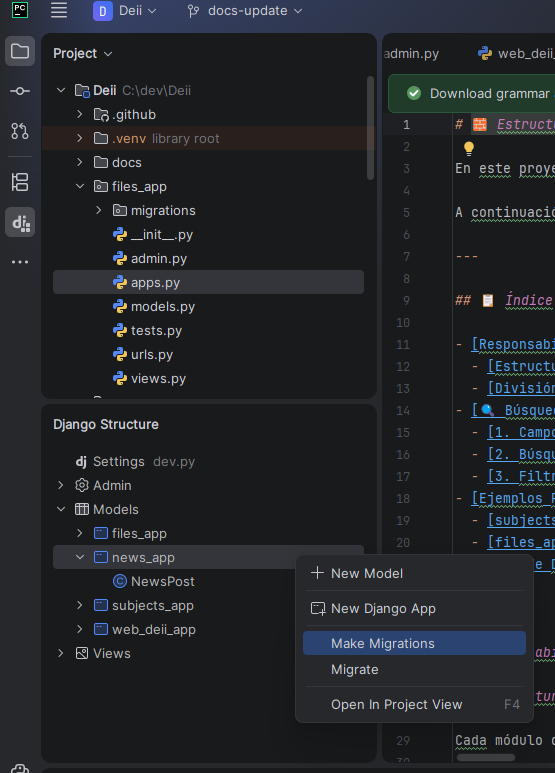

# 🧱 Estructura de Módulos (Django Apps)

En este proyecto, cada funcionalidad o sección del sistema se organiza como una **Aplicación de Django (Django App)** o **Módulo**. Esto nos permite mantener un código modular, escalable, limpio y con responsabilidades bien delimitadas.

A continuación se detalla qué compone un módulo a nivel general, la responsabilidad de cada archivo y cómo se estructuran ejemplos reales del proyecto como [subjects_app](../../subjects_app) y [files_app](../../files_app).

---

## 📋 Índice

- [Responsabilidades y Componentes de un Módulo](#responsabilidades-y-componentes-de-un-módulo)
  - [Estructura de Archivos Estándar](#estructura-de-archivos-estándar)
  - [División de Responsabilidades](#división-de-responsabilidades)
- [🔍 Búsquedas, Filtros y Campos a Devolver](#-búsquedas-filtros-y-campos-a-devolver)
  - [1. Campos a Devolver (Serialización)](#1-campos-a-devolver-serialización)
  - [2. Búsquedas y Filtros Simples](#2-búsquedas-y-filtros-simples)
  - [3. Filtros Complejos y Cruce de Tablas (filters.py)](#3-filtros-complejos-y-cruce-de-tablas-filterspy)
- [Ejemplos Prácticos en el Proyecto](#ejemplos-prácticos-en-el-proyecto)
  - [subjects_app (Módulo Simple)](#subjects_app-módulo-simple)
  - [files_app (Módulo Complejo con Flujo de Archivos)](#files_app-módulo-complejo-con-flujo-de-archivos)
- [Flujo de Desarrollo de un Módulo](#flujo-de-desarrollo-de-un-módulo)

---

## Responsabilidades y Componentes de un Módulo

### Estructura de Archivos Estándar

Cada módulo del proyecto sigue el patrón de arquitectura de Django adaptado para una API REST con **Django REST Framework (DRF)**. La estructura habitual de un módulo es la siguiente:

```text
mi_modulo_app/
├── migrations/          # Historial de cambios y versionado de la base de datos
├── __init__.py          # Indica que la carpeta es un paquete Python
├── admin.py             # Registro y configuración del modelo en el panel de administración
├── apps.py              # Configuración general de la aplicación de Django
├── filters.py           # Opcional: Filtros de búsqueda avanzados y cruce de tablas (django-filter)
├── models.py            # Definición de la estructura de base de datos (Entidades)
├── serializers.py       # Serialización/deserialización de JSON, validaciones y campos a devolver (DRF)
├── urls.py              # Rutas y endpoints locales del módulo
├── views.py             # Lógica de control y endpoints (ViewSets / APIViews)
└── tests.py             # Pruebas unitarias e integración de la app
```

---

### División de Responsabilidades

| Componente | Responsabilidad | ¿Qué hace? |
| :--- | :--- | :--- |
| **`models.py`** | **Capa de Datos (ORM)** | Define las tablas de la base de datos, sus campos, tipos, relaciones (`ForeignKey`, `ManyToManyField`) y restricciones. No debe contener lógica de negocio compleja, solo definición de datos y métodos auxiliares (como `__str__`). |
| **`serializers.py`** | **Tratamiento de Datos (DRF)** | Actúa como un traductor. Convierte objetos complejos de Python/Django (como modelos y QuerySets) a formatos nativos (JSON/XML) para las respuestas de la API, y valida y des-serializa datos entrantes para poder guardarlos de forma segura en la base de datos. **Aquí se definen qué campos se devuelven**. |
| **`filters.py`** | **Filtrado Avanzado** | Opcional. Contiene clases de filtrado (`FilterSet`) de la librería `django-filter` para realizar búsquedas complejas, rangos o **consultas cruzando tablas** mediante relaciones ORM. |
| **`views.py`** | **Capa de Control (Lógica)** | Recibe las peticiones HTTP del cliente, procesa la lógica de negocio necesaria, interactúa con la capa de datos/modelos y serializadores, y devuelve la respuesta HTTP correspondiente (ej. `200 OK`, `400 Bad Request`, `403 Forbidden`). Se usan principalmente `ViewSets` o `APIView` de DRF. **Aquí se declaran los campos de búsqueda simple y ordenación**. |
| **`urls.py`** | **Capa de Enrutamiento** | Mapea las direcciones URL locales del módulo con las funciones o ViewSets de `views.py`. Utiliza el `DefaultRouter` de DRF para generar automáticamente las rutas REST estándar de forma limpia. |
| **`admin.py`** | **Capa de Administración** | Permite registrar los modelos en el Panel de Administración de Django para que los moderadores/administradores puedan realizar operaciones CRUD de forma visual y directa en producción o desarrollo. |
| **`tests.py`** | **Capa de Calidad (Testing)** | Contiene las pruebas automáticas para comprobar que los modelos, serializadores, lógica de negocio y endpoints del módulo funcionan exactamente como se espera ante diferentes escenarios y entradas. |

---

## 🔍 Búsquedas, Filtros y Campos a Devolver

En las APIs del proyecto, gestionamos qué información se expone y cómo permitimos buscarla y filtrarla siguiendo esta división:

### 1. Campos a Devolver (Serialización)
Se definen en `serializers.py` dentro de la configuración del serializador (`class Meta`):
* **`fields`**: Lista de atributos del modelo que se devolverán en la respuesta JSON. Si queremos especificar campos concretos (recomendado para controlar el payload y mejorar el rendimiento), los enumeramos. Si queremos todos, usamos `'__all__'`.
* **Ejemplo**:
  ```python
  class SubjectSerializer(serializers.ModelSerializer):
      class Meta:
          model = Subject
          fields = ['id', 'name', 'degree', 'year']  # Solo expone estos 4 campos en el JSON de salida
  ```

### 2. Búsquedas y Filtros Simples
Se configuran directamente en `views.py` utilizando los backends de Django REST Framework:
* **Búsquedas de texto (`SearchFilter`)**: Permite realizar búsquedas tipo "contiene" (LIKE) en campos específicos mediante el parámetro de consulta `?search=`. Se declaran en `search_fields`.
* **Filtros directos (`DjangoFilterBackend`)**: Filtros de igualdad exacta sobre campos del propio modelo. Se declaran en `filterset_fields`.
* **Ejemplo**:
  ```python
  from rest_framework import viewsets, filters
  from django_filters.rest_framework import DjangoFilterBackend
  from .models import Subject
  from .serializers import SubjectSerializer

  class SubjectViewSet(viewsets.ModelViewSet):
      queryset = Subject.objects.all()
      serializer_class = SubjectSerializer
      filter_backends = [DjangoFilterBackend, filters.SearchFilter]
      filterset_fields = ['degree', 'semester']  # Permite filtrar por igualdad exacta: ?degree=Informática
      search_fields = ['name']                  # Permite buscar en el texto: ?search=Matemáticas
  ```

### 3. Filtros Complejos y Cruce de Tablas (`filters.py`)
Cuando necesitamos filtros más avanzados (ej: rangos de fechas, búsquedas insensibles a mayúsculas, o filtrar por campos de **tablas relacionadas / joins**), creamos un archivo **`filters.py`** dentro del módulo.

Este archivo utiliza la librería `django-filter` definiendo un `FilterSet`:
* **Cruce de Tablas (Relationships / Joins)**: Se utiliza la sintaxis de doble guion bajo (`__`) para acceder a campos de modelos relacionados. Por ejemplo, en `files_app` podemos filtrar archivos que pertenecen a una asignatura de un grado específico cruzando con `subjects_app` mediante su relación.
* **Ejemplo de `filters.py` en `files_app`**:
  ```python
  import django_filters
  from .models import File

  class FileFilter(django_filters.FilterSet):
      # Filtro cruzando tablas: filtra archivos por el nombre o el grado de la asignatura relacionada (subject_id)
      subject_name = django_filters.CharFilter(field_name='subject_id__name', lookup_expr='icontains')
      degree = django_filters.CharFilter(field_name='subject_id__degree', lookup_expr='iexact')
      
      # Filtro de rango: archivos subidos a partir de una fecha concreta
      uploaded_after = django_filters.DateTimeFilter(field_name='uploaded_at', lookup_expr='gte')

      class Meta:
          model = File
          fields = ['uploader', 'is_active'] # Campos con filtros de igualdad exacta directos
  ```
* **Integración en la Vista (`views.py`)**:
  En lugar de usar `filterset_fields`, importamos el filtro de `filters.py` y usamos `filterset_class`:
  ```python
  from django_filters.rest_framework import DjangoFilterBackend
  from .models import File
  from .serializers import FileSerializer
  from .filters import FileFilter  # Importamos nuestro filterset

  class FileViewSet(viewsets.ModelViewSet):
      queryset = File.objects.all()
      serializer_class = FileSerializer
      filter_backends = [DjangoFilterBackend]
      filterset_class = FileFilter  # Asignamos el filtro personalizado con cruce de tablas
  ```

---

## Ejemplos Prácticos en el Proyecto

### 1. `subjects_app` (Módulo Simple)
Este módulo se encarga exclusivamente de gestionar la información de las **asignaturas**. Al ser un catálogo simple, su estructura es directa:

*   **`models.py`**: Define la clase `Subject` con campos básicos como `name`, `degree`, `year`, `semester`, `area`.
*   **`urls.py`**: Registra un enrutador REST (`routers.DefaultRouter()`) para gestionar de forma automática los endpoints típicos de listado, creación, edición y borrado bajo el path `/subjects/`.
*   **`views.py`**: Utiliza vistas genéricas o ViewSets que conectan directamente el modelo `Subject` con su respectivo serializador sin requerir lógica de negocio compleja.

### 2. `files_app` (Módulo Complejo con Flujo de Archivos)
Este módulo gestiona la **subida, aprobación y etiquetado de apuntes/exámenes**. Debido a que maneja ficheros físicos y lógica de estados (pendiente, aprobado, rechazado), su estructura es más avanzada:

*   **`models.py`**: Define los modelos `File` y `Tag`. El modelo `File` cuenta con un campo `file` de tipo `FileField` que usa funciones de callback (`pending_upload_path`, `approved_upload_path`, `denied_upload_path`) para determinar dinámicamente dónde guardar el archivo en disco dependiendo del estado de la moderación. También cuenta con relaciones complejas como `ManyToManyField` con `Subject` e `is_active` para controlar la visibilidad pública.
*   **`filters.py`**: Implementa filtros para cruzar archivos con asignaturas, buscar por grado y filtrar por moderadores que aprobaron el fichero.
*   **Lógica en Vistas**: Sus vistas requieren validaciones adicionales para verificar permisos (ej. solo moderadores pueden aprobar un archivo) y realizar acciones en el sistema de almacenamiento antes de actualizar el estado en base de datos.

---

## Flujo de Desarrollo de un Módulo
Cuando vayas a crear una nueva funcionalidad o añadir un módulo completo, te aconsejamos seguir este orden lógico de desarrollo:

1. **Definir el Modelo**: Escribe las entidades y relaciones en `models.py`.
2. **Crear las Migraciones**: Ejecuta `python manage.py makemigrations <nombre_app>` para generar la migración y pruébala de forma local aplicando `python manage.py migrate`.
3. 
   > [!CAUTION]
   > **Problema de `null=False` con datos existentes:**
   > Si al aplicar una migración en local da un error debido a restricciones `null=False` en nuevos campos, esto se debe a que ya existen registros en la base de datos que carecen de esos campos rellenados. Para solucionarlo y poder seguir con la migración, debes proporcionar un valor por defecto temporal (`default="..."` o definirlo en el prompt interactivo de Django) o rellenar/limpiar los datos existentes previamente en tu base de datos local.
   > 
   > [!IMPORTANT]
   > **Responsabilidad de Ejecución:**
   > Como desarrollador puedes y debes **crear** las migraciones en tu local y subirlas a Git, pero la ejecución de la migración en sí en los servidores de producción/desarrollo de la organización debe ser realizada únicamente por el **responsable de infraestructura**.
3. **Crear el Serializador**: Define qué campos del modelo se enviarán o recibirán mediante la creación del archivo `serializers.py`.
4. **Definir Filtros y Búsquedas**: Si requieres filtros avanzados o joins, crea `filters.py`. Si son simples, prepáralos directamente para la vista.
5. **Programar las Vistas**: Crea los controladores/endpoints en `views.py` para manejar las peticiones HTTP y configura sus correspondientes `filterset_class`, `filterset_fields` o `search_fields`.
6. **Configurar las Rutas**: Asocia las vistas a urls en `urls.py` y asegúrate de incluir el archivo `urls.py` local en el archivo global `web_deii_project/urls.py`.
7. **Registrar en Admin**: Facilita la administración registrando tus modelos en `admin.py`.
8. **Escribir Pruebas**: Añade tests unitarios en `tests.py` que verifiquen el correcto funcionamiento de tu flujo.
