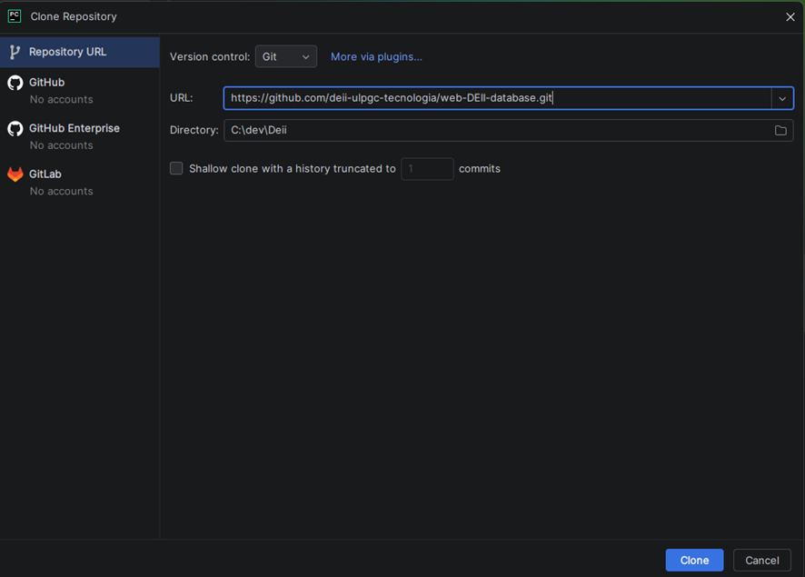
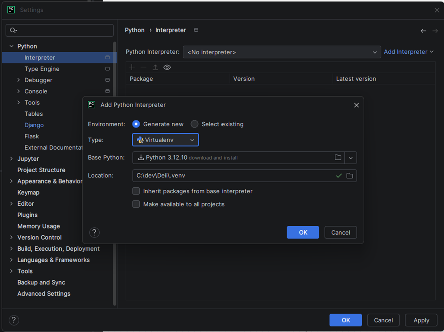
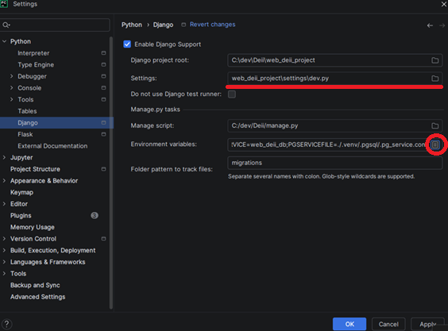
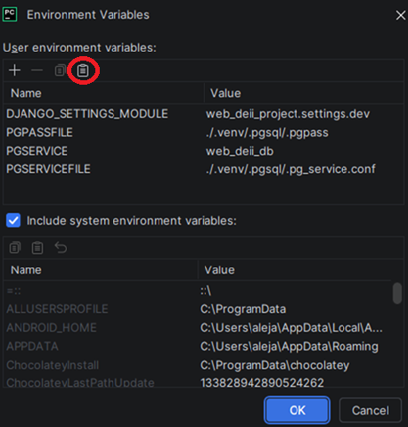
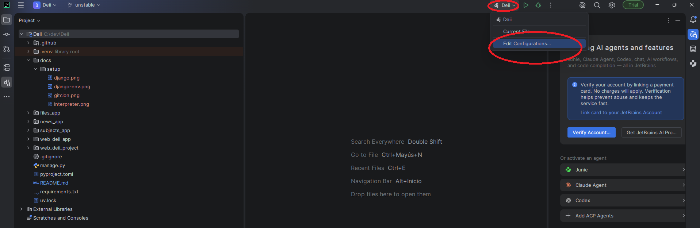
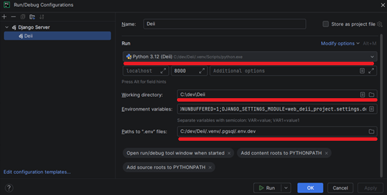

# 🛠️ Preparación del entorno

> **Importante:** Antes de comenzar, debes pedir las variables de entorno del proyecto al responsable, al igual que el acceso .

---

## 📋 Índice

- [1. Clonar el repositorio](#1-clonar-el-repositorio)
- [2. Configurar entorno virtual de Python](#2-configurar-entorno-virtual-de-python)
- [3. Configurar el IDE](#3-configurar-el-ide)
  - [3.1 Variables de entorno](#31-variables-de-entorno)
  - [3.2 Configurar Django](#32-configurar-django)
  - [3.3 Configuración para la ejecución local](#33-configuración-para-la-ejecución-local)

---

## 1. Clonar el repositorio

Puedes clonar el repositorio usando la terminal:

```bash
git clone https://github.com/DEII-UNAM/web-DEII-database.git
cd web-DEII-database
```

O también puedes hacerlo directamente con **PyCharm**:



---

## 2. Configurar entorno virtual de Python

> ⚠️ Tiene que ser con **Python 3.12.X**



Desde la terminal, instala las dependencias:

```bash
pip install -r requirements.txt
```

---

## 3. Configurar el IDE

### 3.1 Variables de entorno
Pon las variables de entorno dentro de la carpeta `.venv/`.

### 3.2 Configurar Django
Ve a las preferencias del IDE y busca la configuración de **Settings > Django**:



Copia las variables del archivo  de `.venv/.pgsql/.env.dev`y pégalas en la parte de variables de entorno de la configuración de Django:



Aplica los cambios.

### 3.3 Configuración para la ejecución local
Crea o ajusta la configuración de ejecución (Run/Debug Configurations):




Una vez configurado, dale a **Apply** y luego a **Run** para comprobar que todo está correcto.
